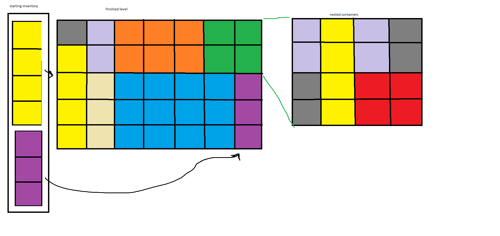
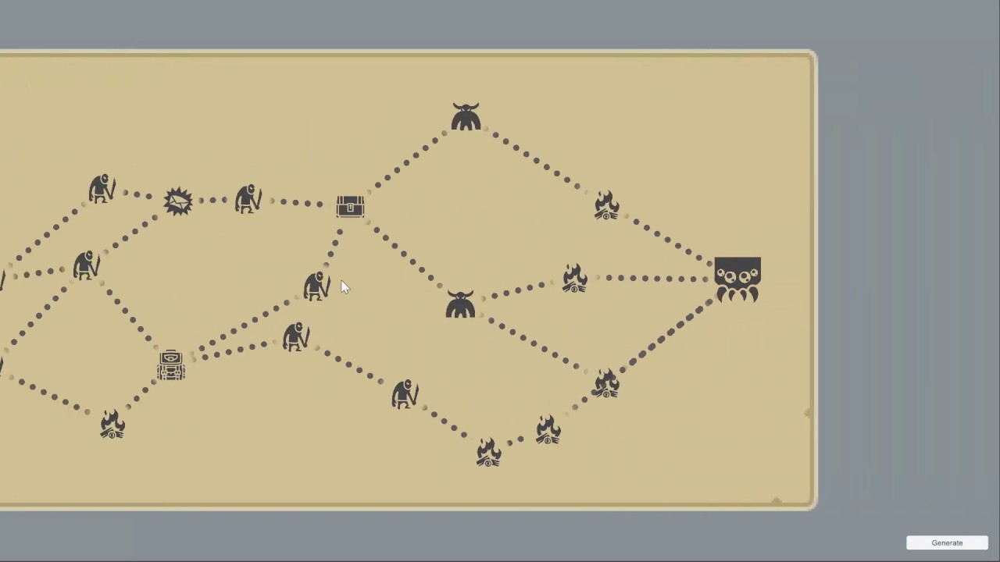

(J) Overall design ideas:

 - offline puzzle-like 2d platformer
 - chaos + innovation: gravity amount changes based on some in-game reward mechanism
 - or building on the puzzle beginning, the puzzles require time-travel where the player
   gets to play through the level 3-4 times, with previous plays being replayed on top of the current
   run. This means the player will have to time things by remembering where they went?

 - Puzzle "Knapsack Problem" Game
   - Randomly sized inventory generated, with items to fill it
   - 
   - Have the player collect items? "Walk" (click on nodes) through path like below?
   - 
   - [Potential Inventory System?](https://assetstore.unity.com/packages/tools/gui/variable-inventory-system-174157)
     - Would we rather write one ourselves? Or make use of this and try and add more features?

